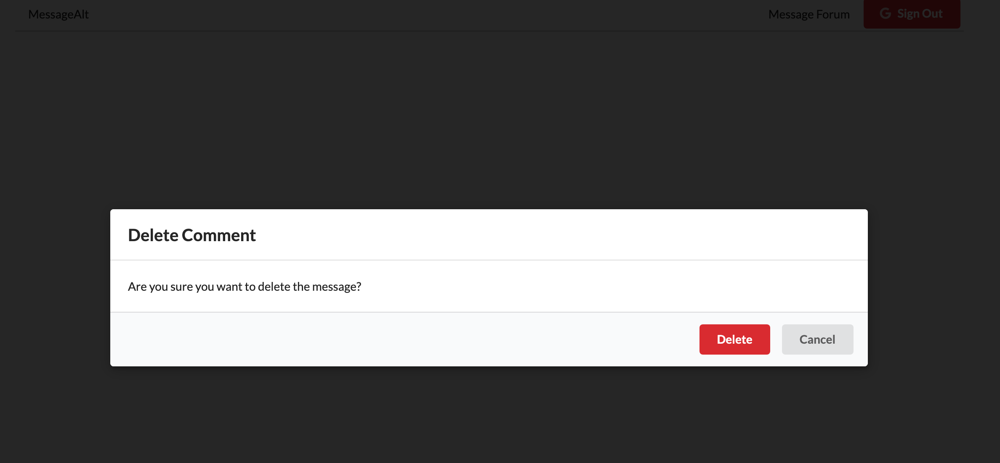

# message Alt

A message board in which users can interact with other users.

## Features 

- Sign in/out through Google Cloud Platform for each user. 
- Create a message for the entire board to view.
- Edit your own message.
- Delete your own message.
- Reply to other user message.


## Final Product




## Getting Started

1. Fork this repository, then clone it.
2. Install the dependencies using the `npm install` command.
3. Start the server using `npm start`.
3. Start the client using `npm start`. The app will be served at <http://localhost:3000/>.
4. Go to <http://localhost:3000/> in your browser.

## Run the  server folder

```sh
npm start
```

## Run the client folder

```sh
npm start
```

## Dependencies

- axios
- flv.js
- lodash
- react
- react-dom
- react-redux
- react-router-dom
- react-scripts
- faker
- redux
- redux-form
- redux-thunk

